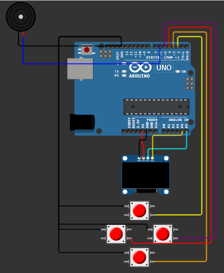

# Snake Game — Arduino + OLED + Buzzer

Juego Snake clásico para Arduino con pantalla OLED SSD1306 y efectos de sonido en buzzer pasivo. Desarrollado para la inscripción al **Club Kokoa**.

## Demo — Simulación en Wokwi

[Probar la simulación en línea](https://wokwi.com/projects/470542448604225537)

## Diagrama de circuito



## Características

- Pantalla OLED 128x64 (SSD1306, I2C)
- 4 botones direccionales
- Buzzer pasivo con:
  - Sonido al iniciar la partida
  - Chirp al comer la fruta
  - Melodía de game over
- Puntaje en pantalla
- Pantalla de inicio y game over personalizadas en español
- Generación aleatoria de frutas
- Detección de colisión con paredes y cuerpo

## Hardware necesario

| Componente | Cantidad |
|---|---|
| Arduino Uno / Nano | 1 |
| Pantalla OLED SSD1306 128x64 (I2C) | 1 |
| Buzzer pasivo | 1 |
| Pulsadores / botones | 4 |
| Cables y protoboard | — |

## Conexiones

### OLED SSD1306 (I2C)
| OLED | Arduino |
|---|---|
| VCC | 3.3V o 5V |
| GND | GND |
| SDA | A4 |
| SCL | A5 |

Dirección I2C: `0x3C`

### Botones
| Función | Pin Arduino |
|---|---|
| LEFT | 4 |
| UP | 2 |
| RIGHT | 5 |
| DOWN | 3 |

Cada botón conectado entre el pin y GND (usa `INPUT_PULLUP`).

### Buzzer pasivo
| Buzzer | Arduino |
|---|---|
| + (positivo) | Pin 6 |
| − (negativo) | GND |

Usar buzzer **pasivo**, no activo. La función `tone()` requiere un buzzer pasivo para generar distintas frecuencias.

## Librerías requeridas

Instalar desde el Library Manager del IDE de Arduino:

- **Adafruit GFX Library** — Adafruit Industries
- **Adafruit SSD1306** — Adafruit Industries

## Cómo cargar

1. Clonar o descargar este repositorio
2. Abrir `snake_game.ino` en el IDE de Arduino
3. Instalar las librerías indicadas
4. Seleccionar tu placa y puerto en Herramientas
5. Cargar con el botón Upload

## Configuración

```cpp
#define SNAKE_PIECE_SIZE     3   // Tamaño de cada bloque en px
#define MAX_SNAKE_LENGTH   165   // Longitud máxima de la serpiente
#define MAP_SIZE_X          20   // Ancho del mapa en celdas
#define MAP_SIZE_Y          20   // Alto del mapa en celdas
#define STARTING_SNAKE_SIZE  5   // Tamaño inicial
#define SNAKE_MOVE_DELAY    30   // Velocidad (menor = más rápido)
#define BUZZER_PIN           6   // Pin del buzzer
```

## Inspiración

Este proyecto se basó e inspiró en:

- [arduino_snake](https://github.com/Stiju/arduino_snake) por **Stiju** — estructura base del juego Snake en Arduino con pantalla OLED
- [Wokwi Project #296135008348799496](https://wokwi.com/projects/296135008348799496) — implementación de referencia en simulador

## Licencia

MIT — libre para usar, modificar y compartir.
